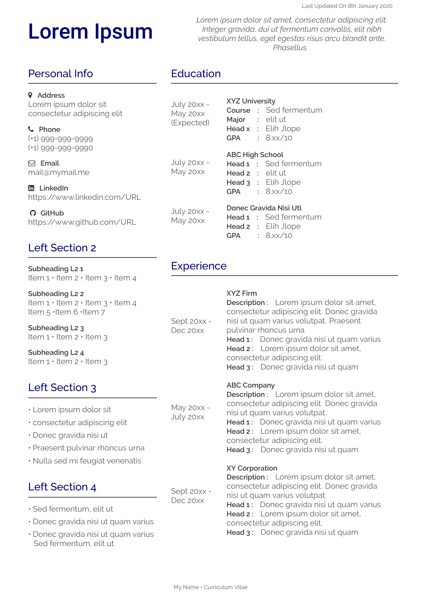
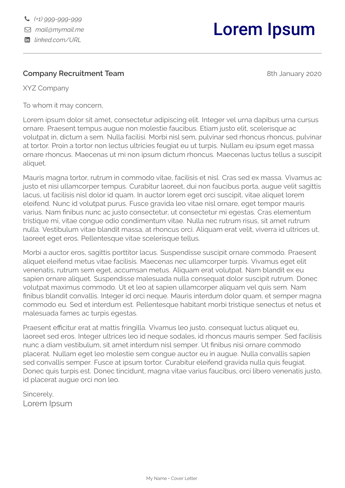

<h1 align='center'> cvTemplate </h1>

<h4 align='center'>A simple and easy to customize two-column style LaTeX template for a CV, Résumé or Cover Letter. </h4>

---

## Screens :

<h3 align='center'> Curriculum Vitae </h3>

---

<h3 align='center'> Cover Letter </h3>

